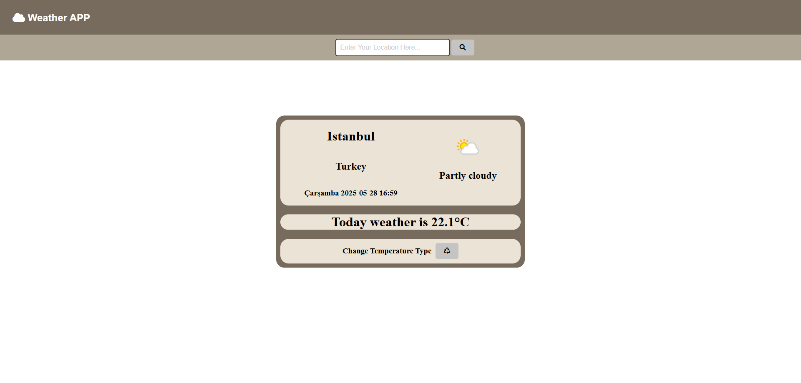

# ☁️ Weather App

**Weather App** is a simple web application that allows users to view real-time weather information for different cities. The app fetches weather data from an external API and displays temperature, conditions, and city-specific information in a clean UI. 

---

## 🎯 Purpose

- 🌍 Show current weather details for selected cities
- 🌡️ Display temperature and weather conditions dynamically
- 🔍 Enhance API usage skills with a practical project

---

## 🚀 Features

- 📍 **City-Based Weather Information**
  - Search and display weather for any city
- 🌤️ **Live Weather Data**
  - Fetch data using a weather API
- 🎨 **Responsive Design**
  - Built with HTML, CSS and JavaScript

---

## 🛠️ Tech Stack

| Layer         | Technologies     |
|---------------|------------------|
| Frontend      | HTML, CSS, JavaScript |
| API           | OpenWeatherMap  |
| Tools         | Git, GitHub, VS Code     |

---



---
## 📦 Getting Started


Clone the repository and open the `weather.html` file in your browser:


```bash
git clone https://github.com/kuyucucaner/Weather-App.git
cd Weather-App

## 🛡️ Environment Variables

apiKey= your_api_key
